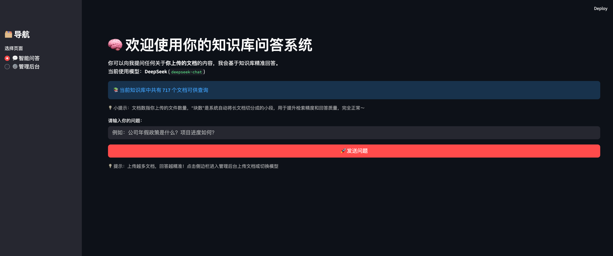
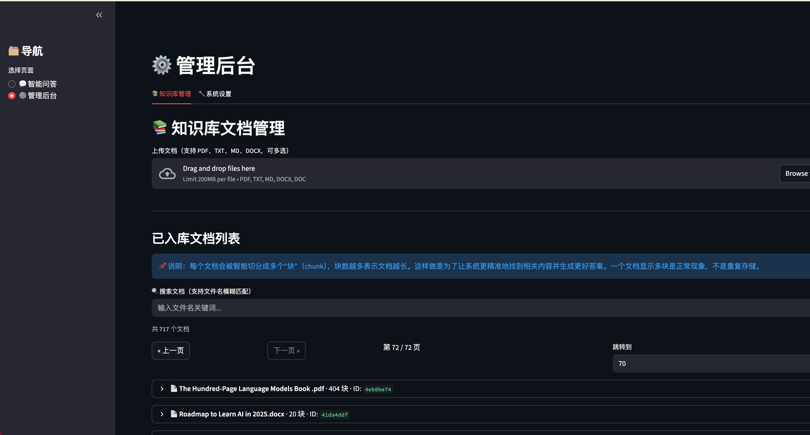
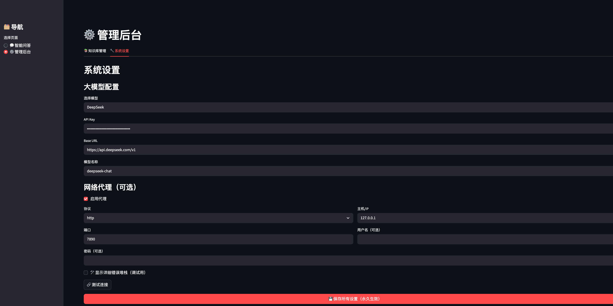

# KnowBase - 私人 RAG 知识库系统(让你的知识不再沉睡！)


一个完全本地运行、隐私安全的**个人 RAG（Retrieval-Augmented Generation）知识库系统**。让你把散落的文档、笔记、报告、书籍全部上传，形成一个专属的“第二大脑”，随时用自然语言提问，就能得到精准、带原文出处的答案。

## 📸 系统截图

### 智能问答页面


### 知识库管理后台（文档上传、分页搜索、删除）


### 系统设置页面（多模型切换、代理配置、连接测试）


## 🌟 核心亮点

- **100% 本地存储**：所有文档和向量数据库保存在本地，隐私完全掌握在自己手中
- **支持多种文档格式**：PDF(支持OCR识别图片)、TXT、MD、DOCX，一键上传自动解析
- **智能文档切分 + 向量检索**：基于 BGE 嵌入模型，实现高精度语义检索
- **多大模型随意切换**：一键切换 DeepSeek、OpenAI (ChatGPT)、Groq、Claude、Gemini，永远用当时最好的模型
- **内置代理支持**：HTTP/HTTPS/SOCKS5 全协议支持 + 一键测试连接，国内使用无压力
- **持久化配置**：模型、API Key、代理设置永久保存，重启后自动加载
- **优雅的 Web 界面**（Streamlit）：
  - 直接进入智能问答
  - 管理后台：文档上传/搜索/分页查看/删除 + 系统设置
- **开箱即用**：几分钟部署，无需复杂配置

## 🎯 适合谁用？

- 知识工作者：快速查找历史报告、会议纪要、合同条款
- 学生/研究员：管理海量论文、笔记、书籍，提问即得精准引用
- 家长/生活达人：存育儿经验、健康档案、旅行攻略、菜谱
- 投资爱好者：整理研报、财报、投资笔记，一问即答
- 所有想把个人知识数字化、可检索的人

用得越久，系统越懂你 —— 它会成为你数字人生中最有价值的私人助手。

## 🚀 快速开始

### 1. 克隆仓库
```bash
git clone https://github.com/jacky850618/personal-rag-knowledge-base.git
cd personal-rag-knowledge-base
```

### 2. 安装依赖（推荐新建虚拟环境）
```

brew install poppler

pip install -r requirements.txt
```

### 3. （中国大陆用户）加速下载嵌入模型
```
export HF_ENDPOINT=https://hf-mirror.com
```

### 4. 启动应用

```
streamlit run app.py
```

打开浏览器访问 http://localhost:8501，即可开始使用！
第一次运行会自动下载 BGE 嵌入模型（约 1GB），后续即秒开。


## 项目结构
```
.
├── app.py                  # 主界面（智能问答 + 管理后台）
├── config_manager.py       # 持久化配置管理
├── knowledge_manager.py    # 知识库 CRUD 逻辑
├── embeddings.py           # 嵌入模型封装
├── data/                   # 上传的原始文档
├── chroma_db/              # 向量数据库（自动生成）
├── config/user_settings.json # 永久保存的配置（模型、Key、代理）
└── requirements.txt
```

## 配置说明
1. 在【管理后台 → 系统设置】填写你的大模型 API Key
1. 支持代理：填写主机、端口、协议（http/https/socks5）
1. 配置自动永久保存到 config/user_settings.json

## 🤝 贡献
欢迎 Star、Fork、Issue、PR！
如果你有好的想法（比如添加聊天历史、加密存储等），非常欢迎一起完善这个私人知识库。

## 开源协议
MIT License - 随意使用、修改、商用均可。